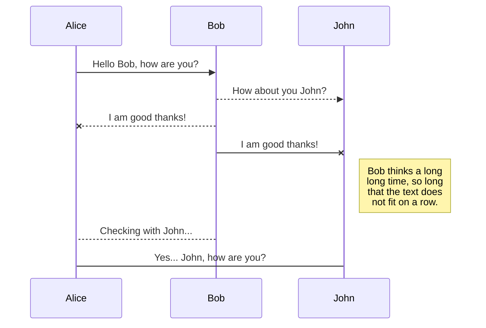
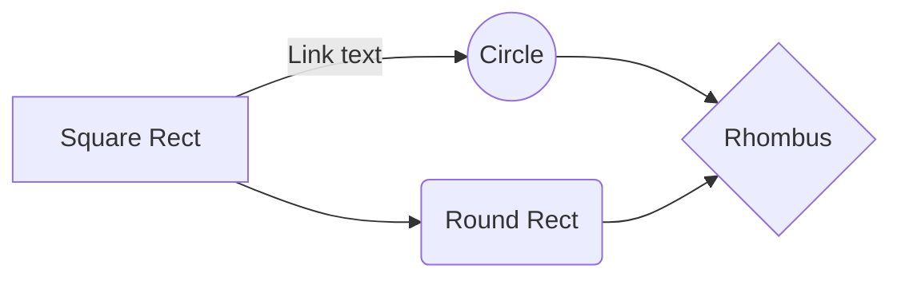

# Welcome to StackEdit!

lorem ipsum

This is NOT completed by following any tutorial, but completed and actively self-learned with the help of LLMs

As a novice coder and an AI/ML enthusiast I have used my opportunity to
The reason why there are a lot of markdown cells is so that I understand more of why I did what I did. 

Throughout this project, I've adopted a cell-specific import strategy, introducing libraries at the point of use rather than consolidating all imports at the beginning. This deliberate choice enhances the educational value of the notebook by clearly demonstrating which libraries are required for each specific functionality, making it easier to understand the dependencies for individual operations. As this project serves primarily as an exploration and learning exercise, this approach provides better context for anyone reviewing or learning from the code.

Technology used:
vscode
jupyter notebook
google colab
github
chatgpt/claude 3.7/gemini

# Files

lorem ipsum

## Download Relevant Files

Movie Files Downloaded from IMDB database
Files downloaded from: https://datasets.imdbws.com/
Dataset information: https://developer.imdb.com/non-commercial-datasets/

Audience rating dataset downloaded from 

 - title.basics.tsv.gz: Contains basic information about titles (movies,
   TV shows) 
 - title.ratings.tsv.gz: Contains IMDb ratings
 - title.crew.tsv.gz: Contains director and writer information
 - name.basics.tsv.gz: Contains information about people (actors,
   directors) 
 - title.principals.tsv.gz: Contains principal cast/crew for titles
 - title.episode.tsv.gz: Contains TV episodes to their parent TV series

## Switch to another file

# IMDB Movie Dataset

This document provides an overview of our merged movie dataset containing information from IMDB.

## Dataset Structure

The dataset combines movie basics, ratings, and crew information with the following columns:

| Column | Description |
|--------|-------------|
| tconst | Unique identifier for each title |
| isAdult | Flag indicating adult content (0 = no, 1 = yes) |
| startYear | Year of release |
| genres | Comma-separated list of genres |
| runtimeMinutes | Length of the movie in minutes |
| averageRating | Average user rating (scale of 1-10) |
| directors | Comma-separated list of director IDs |
| writers | Comma-separated list of writer IDs |

## Sample Data

Below is a sample of the merged dataset:

| tconst | isAdult | startYear | genres | runtimeMinutes | averageRating | directors | writers |
|--------|---------|-----------|--------|---------------|--------------|-----------|---------|
| tt0002130 | 0 | 1911 | Adventure,Drama,Fantasy | 71 | 7.0 | nm0078205,nm0655824,nm0209738 | nm0019604 |
| tt0002423 | 0 | 1919 | Biography,Drama,Romance | 113 | 6.6 | nm0523932 | nm0266183,nm0473134 |
| tt0002844 | 0 | 1913 | Crime,Drama | 54 | 6.9 | nm0275421 | nm0019855,nm0275421,nm0816232 |
| tt0003014 | 0 | 1913 | Drama | 96 | 7.0 | nm0803705 | nm0472236,nm0803705 |
| tt0003037 | 0 | 1913 | Crime,Drama | 61 | 6.9 | nm0275421 | nm0019855,nm0275421,nm0816232 |
| tt0003165 | 0 | 1913 | Crime,Drama,Mystery | 90 | 6.9 | nm0275421 | nm0019855,nm0275421,nm0816232 |

## Notes

- Director and writer IDs (starting with "nm") can be cross-referenced with the IMDB name database to get actual names
- The dataset has been cleaned and merged from multiple IMDB source files
- All adult content is flagged for appropriate filtering

## Rename a file

You can rename the current file by clicking the file name in the navigation bar or by clicking the **Rename** button in the file explorer.

## Delete a file

lorem ipsum

## Export a file

lorem ipsum

# Synchronization

lorem ipsum

## Open a file

lorem ipsum

## Save a file

lorem ipsum

## Synchronize a file

lorem ipsum

> **Note:** The **Synchronize now** button is disabled if you have no file to synchronize.

## Manage file synchronization

lorem ipsum

# Publication

Publishing in StackEdit makes it simple for you to publish online your files. Once you're happy with a file, you can publish it to different hosting platforms like **Blogger**, **Dropbox**, **Gist**, **GitHub**, **Google Drive**, **WordPress** and **Zendesk**. With [Handlebars templates](http://handlebarsjs.com/), you have full control over what you export.

> Before starting to publish, you must link an account in the **Publish** sub-menu.

## Publish a File

lorem ipsum

## Update a publication

lorem ipsum

> **Note:** The **Publish now** button is disabled if your file has not been published yet.

## Manage file publication

lorem ipsum

# Markdown extensions

lorem ipsum

> **ProTip:** You can disable any **Markdown extension** in the **File properties** dialog.

## SmartyPants

SmartyPants converts ASCII punctuation characters into "smart" typographic punctuation HTML entities. For example:

|                |ASCII                          |HTML                         |
|----------------|-------------------------------|-----------------------------|
|Single backticks|`'Isn't this fun?'`            |'Isn't this fun?'            |
|Quotes          |`"Isn't this fun?"`            |"Isn't this fun?"            |
|Dashes          |`-- is en-dash, --- is em-dash`|-- is en-dash, --- is em-dash|

## KaTeX

You can render LaTeX mathematical expressions using [KaTeX](https://khan.github.io/KaTeX/):

The *Gamma function* satisfying $\Gamma(n) = (n-1)!\quad\forall n\in\mathbb N$ is via the Euler integral

$$
\Gamma(z) = \int_0^\infty t^{z-1}e^{-t}dt\,.
$$

> You can find more information about **LaTeX** mathematical expressions [here](http://meta.math.stackexchange.com/questions/5020/mathjax-basic-tutorial-and-quick-reference).

## UML diagrams

You can render UML diagrams using [Mermaid](https://mermaidjs.github.io/). For example, this will produce a sequence diagram:

And this will produce a flow chart:

### **title.basics.tsv.gz**

-   tconst (string) - alphanumeric unique identifier of the title
-   titleType (string) – the type/format of the title (e.g. movie, short, tvseries, tvepisode, video, etc)
-   primaryTitle (string) – the more popular title / the title used by the filmmakers on promotional materials at the point of release
-   originalTitle (string) - original title, in the original language
-   isAdult (boolean) - 0: non-adult title; 1: adult title
-   startYear (YYYY) – represents the release year of a title. In the case of TV Series, it is the series start year
-   endYear (YYYY) – TV Series end year. '\N' for all other title types
-   runtimeMinutes – primary runtime of the title, in minutes
-   genres (string array) – includes up to three genres associated with the title

### **title.crew.tsv.gz**

-   tconst (string) - alphanumeric unique identifier of the title
-   directors (array of nconsts) - director(s) of the given title
-   writers (array of nconsts) – writer(s) of the given title

### **title.episode.tsv.gz**

-   tconst (string) - alphanumeric identifier of episode
-   parentTconst (string) - alphanumeric identifier of the parent TV Series
-   seasonNumber (integer) – season number the episode belongs to
-   episodeNumber (integer) – episode number of the tconst in the TV series

### **title.principals.tsv.gz**

-   tconst (string) - alphanumeric unique identifier of the title
-   ordering (integer) – a number to uniquely identify rows for a given titleId
-   nconst (string) - alphanumeric unique identifier of the name/person
-   category (string) - the category of job that person was in
-   job (string) - the specific job title if applicable, else '\N'
-   characters (string) - the name of the character played if applicable, else '\N'

### **title.ratings.tsv.gz**

-   tconst (string) - alphanumeric unique identifier of the title
-   averageRating – weighted average of all the individual user ratings
-   numVotes - number of votes the title has received

### **name.basics.tsv.gz**

-   nconst (string) - alphanumeric unique identifier of the name/person
-   primaryName (string)– name by which the person is most often credited
-   birthYear – in YYYY format
-   deathYear – in YYYY format if applicable, else '\N'
-   primaryProfession (array of strings)– the top-3 professions of the person
-   knownForTitles (array of tconsts) – titles the person is known for