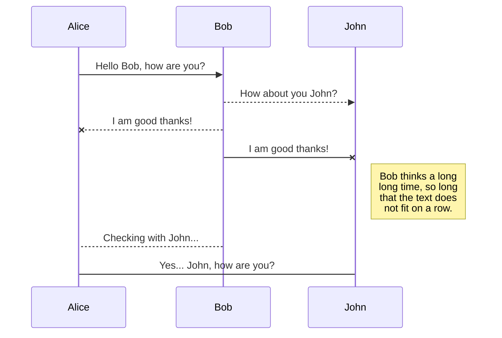
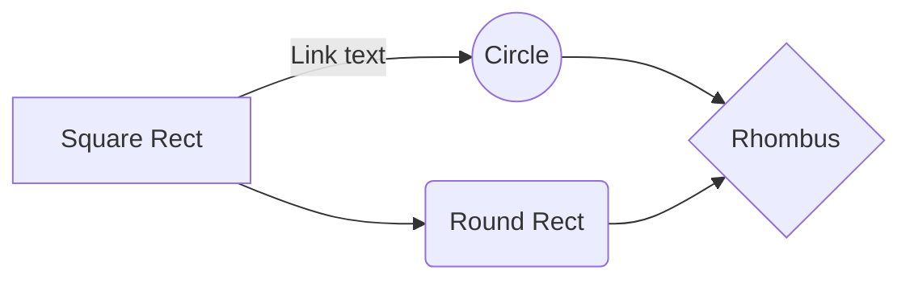

# Welcome to StackEdit!

lorem ipsum
### Step 3: Computing Movie Similarities

To recommend movies, we need to find how similar two movies are based on user ratings. We use **cosine similarity**, which measures how close two movies are in rating patterns. 

- **Cosine Similarity Formula**:  
  \[
  \cos(\theta) = \frac{A \cdot B}{||A|| \times ||B||}
  \]
  where **A** and **B** are rating vectors for two movies.

- **Key Steps:**
  1. Extract user ratings for each movie.
  2. Compute cosine similarity between every pair of movies.
  3. Store these values in a **similarity matrix** for quick lookup.

This similarity matrix helps in predicting user ratings based on movies they have already rated.

# Files

lorem ipsum

## Download Relevant Files

Movie Files Downloaded from IMDB database
Files downloaded from: https://datasets.imdbws.com/
Dataset information: https://developer.imdb.com/non-commercial-datasets/

Audience rating dataset downloaded from 

 - title.basics.tsv.gz: Contains basic information about titles (movies,
   TV shows) 
 - title.ratings.tsv.gz: Contains IMDb ratings
 - title.crew.tsv.gz: Contains director and writer information
 - name.basics.tsv.gz: Contains information about people (actors,
   directors) 
 - title.principals.tsv.gz: Contains principal cast/crew for titles
 - title.episode.tsv.gz: Contains TV episodes to their parent TV series

## Switch to another file

lorem ipsum

## Rename a file

You can rename the current file by clicking the file name in the navigation bar or by clicking the **Rename** button in the file explorer.

## Delete a file

lorem ipsum

## Export a file

lorem ipsum

# Synchronization

lorem ipsum

## Open a file

lorem ipsum

## Save a file

lorem ipsum

## Synchronize a file

lorem ipsum

> **Note:** The **Synchronize now** button is disabled if you have no file to synchronize.

## Manage file synchronization

lorem ipsum

# Publication

Publishing in StackEdit makes it simple for you to publish online your files. Once you're happy with a file, you can publish it to different hosting platforms like **Blogger**, **Dropbox**, **Gist**, **GitHub**, **Google Drive**, **WordPress** and **Zendesk**. With [Handlebars templates](http://handlebarsjs.com/), you have full control over what you export.

> Before starting to publish, you must link an account in the **Publish** sub-menu.

## Publish a File

lorem ipsum

## Update a publication

lorem ipsum

> **Note:** The **Publish now** button is disabled if your file has not been published yet.

## Manage file publication

lorem ipsum

# Markdown extensions

lorem ipsum

> **ProTip:** You can disable any **Markdown extension** in the **File properties** dialog.

## SmartyPants

SmartyPants converts ASCII punctuation characters into "smart" typographic punctuation HTML entities. For example:

|                |ASCII                          |HTML                         |
|----------------|-------------------------------|-----------------------------|
|Single backticks|`'Isn't this fun?'`            |'Isn't this fun?'            |
|Quotes          |`"Isn't this fun?"`            |"Isn't this fun?"            |
|Dashes          |`-- is en-dash, --- is em-dash`|-- is en-dash, --- is em-dash|

## KaTeX

You can render LaTeX mathematical expressions using [KaTeX](https://khan.github.io/KaTeX/):

The *Gamma function* satisfying $\Gamma(n) = (n-1)!\quad\forall n\in\mathbb N$ is via the Euler integral

$$
\Gamma(z) = \int_0^\infty t^{z-1}e^{-t}dt\,.
$$

> You can find more information about **LaTeX** mathematical expressions [here](http://meta.math.stackexchange.com/questions/5020/mathjax-basic-tutorial-and-quick-reference).

## UML diagrams

You can render UML diagrams using [Mermaid](https://mermaidjs.github.io/). For example, this will produce a sequence diagram:

And this will produce a flow chart:

### **title.basics.tsv.gz**

-   tconst (string) - alphanumeric unique identifier of the title
-   titleType (string) – the type/format of the title (e.g. movie, short, tvseries, tvepisode, video, etc)
-   primaryTitle (string) – the more popular title / the title used by the filmmakers on promotional materials at the point of release
-   originalTitle (string) - original title, in the original language
-   isAdult (boolean) - 0: non-adult title; 1: adult title
-   startYear (YYYY) – represents the release year of a title. In the case of TV Series, it is the series start year
-   endYear (YYYY) – TV Series end year. '\N' for all other title types
-   runtimeMinutes – primary runtime of the title, in minutes
-   genres (string array) – includes up to three genres associated with the title

### **title.crew.tsv.gz**

-   tconst (string) - alphanumeric unique identifier of the title
-   directors (array of nconsts) - director(s) of the given title
-   writers (array of nconsts) – writer(s) of the given title

### **title.episode.tsv.gz**

-   tconst (string) - alphanumeric identifier of episode
-   parentTconst (string) - alphanumeric identifier of the parent TV Series
-   seasonNumber (integer) – season number the episode belongs to
-   episodeNumber (integer) – episode number of the tconst in the TV series

### **title.principals.tsv.gz**

-   tconst (string) - alphanumeric unique identifier of the title
-   ordering (integer) – a number to uniquely identify rows for a given titleId
-   nconst (string) - alphanumeric unique identifier of the name/person
-   category (string) - the category of job that person was in
-   job (string) - the specific job title if applicable, else '\N'
-   characters (string) - the name of the character played if applicable, else '\N'

### **title.ratings.tsv.gz**

-   tconst (string) - alphanumeric unique identifier of the title
-   averageRating – weighted average of all the individual user ratings
-   numVotes - number of votes the title has received

### **name.basics.tsv.gz**

-   nconst (string) - alphanumeric unique identifier of the name/person
-   primaryName (string)– name by which the person is most often credited
-   birthYear – in YYYY format
-   deathYear – in YYYY format if applicable, else '\N'
-   primaryProfession (array of strings)– the top-3 professions of the person
-   knownForTitles (array of tconsts) – titles the person is known for
